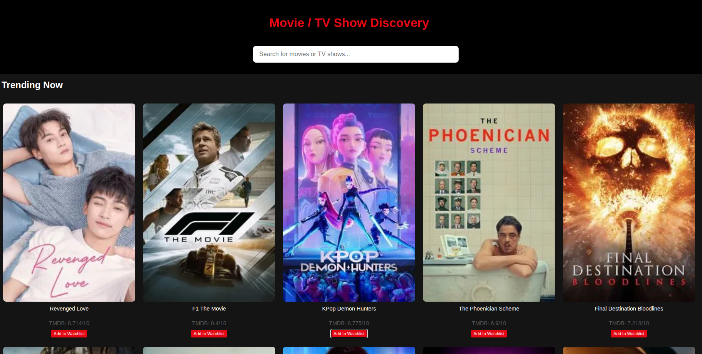
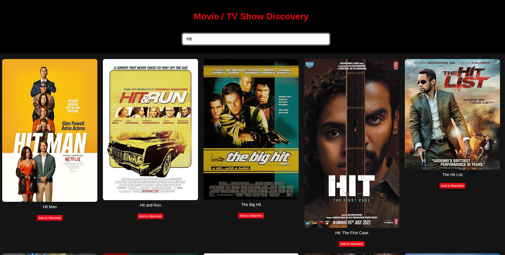
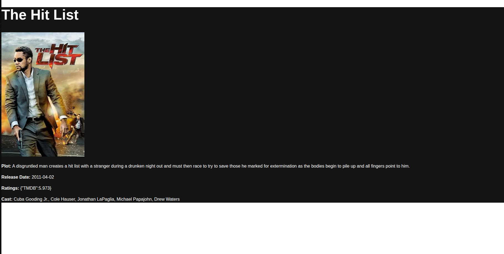

# CineSense 🎬

CineSense is a movie and TV show discovery platform that integrates with TMDB and OMDB APIs.  
It supports searching, browsing trending titles, managing a personal watchlist (add/remove, mark as watched), pagination, and more — all with a responsive, Netflix-style UI.

---

## 🚀 Features

- Search movies and TV shows via TMDB and OMDB APIs.
- View trending content on the homepage.
- Pagination for search results.
- Personal watchlist management (add/remove, mark as watched).
- Persistent data using `localStorage`.
- Responsive grid layout, optimized for mobile and desktop.

---

## 📸 Screenshots

> 👉 **Add your screenshots in this section. Suggested images:**
>
> - Homepage with trending movies  
>   
>
> - Search results page  
>   
>
> - Movie details view  
>   
>
> - Watchlist management view  
>   

---

## ⚙️ Setup Instructions

### 1️⃣ Clone the repository
```bash
git clone https://github.com/your-username/cinesense.git
cd cinesense
```

### Install dependencies

```bash
npm install
```

### Add environment variables

``` bash
VITE_CINESENSE_TMDB_API_KEY=your_tmdb_api_key_here
VITE_CINESENSE_OMDB_API_KEY=your_omdb_api_key_here

```
### Run the development server
```bash
npm run dev
```

## Project Structure
```bash
src/
├── components/
│   ├── MovieCard/
│   └── SearchBar/
├── hooks/
│   └── useWatchlist.js
├── pages/
│   └── HomePage.jsx
├── services/
│   ├── omdb.js
│   └── tmdb.js
└── App.jsx

```

## Note
- Make sure your API keys are valid.

- TMDB API has rate limits. The app falls back to OMDB when needed.

- You can customize the grid, colors, and responsiveness further in HomePage.css or your component styles.